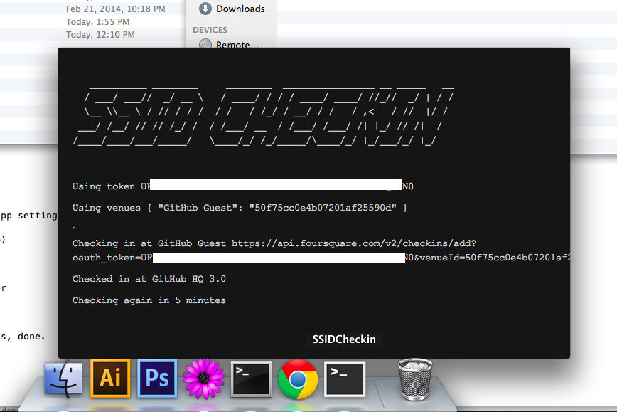

# ssid-checkin app

to build a mac app:

```
clone this repo
cd ssid-checkin/app
npm install
npm run build
```

first you'll have to get a foursquare API token. I think maybe this page makes them? https://developer.foursquare.com/docs/explore#req=users/self I got mine from an existing foursquare oauth app I had written

then look in `build/releases/SSIDCheckin/mac` for your app

currently you have to set your token manually.

right click on the app in finder and 'Show Package Contents', then edit `Contents/Resources/app.nw/token.txt`

to edit venues: `Contents/Resources/app.nw/venues.json`

## screenshot of app running

(it's using the `frameless` setting of node-webkit)


